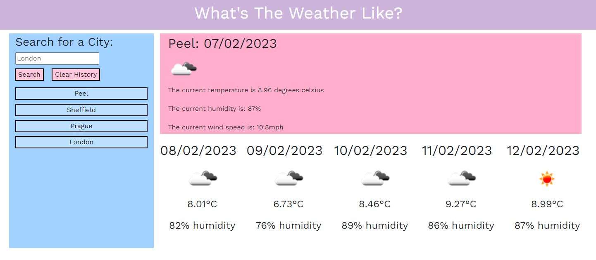
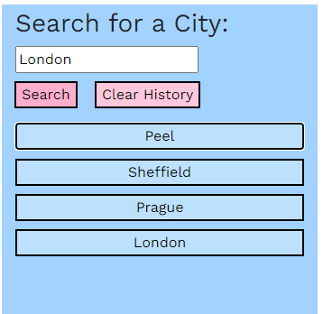

# What's The Weather Like?

## Deployed Application

Please enjoy the deployed application here: https://callumquirky.github.io/what-is-the-weather-like/

## Description

A weather application that utilises jQuery, moment.js and the OpenWeatherMap API to provide the user with the most update to date weather information for any city they want! The app has one section that dispays the current weather:

There is another that generates a 5 day forecast so they can plan their week ahead:

The app automatically stores the user's searches in local storage in order to generate a button on the side of the page with their searches, so that they don't need to make repeated searches if they visit the app frequently.

## License

This project uses an MIT license.

